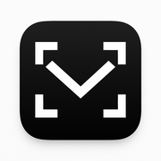

# 🖼️ **Quick Image Guide for vibEmail**

## ✅ **Current Status**
- ✅ **Logo/Branding**: Ready to use (extracted from app icons)
- ⏳ **Screenshots**: Placeholders ready, need real screenshots

## 🚀 **Quick Steps to Add Screenshots**

### **Option A: Use iOS Simulator (Recommended)**
```bash
# 1. Open and run the project
open vibEmail.xcodeproj
# Build and run (Cmd+R) in iPhone 14 simulator

# 2. Take screenshots in simulator
# - Main email list: Cmd+S, save as "Simulator Screen Shot - iPhone 14 - email-list.png"
# - Email detail view: Open email, Cmd+S, save as "Simulator Screen Shot - iPhone 14 - email-detail.png"  
# - AI features: Show AI features, Cmd+S, save as "Simulator Screen Shot - iPhone 14 - ai-features.png"

# 3. Move and rename screenshots
cd /Users/bryansun/git/vibEmail
mv ~/Desktop/Simulator\ Screen\ Shot\ -\ iPhone\ 14\ -\ email-list.png images/screenshots/email-list.png
mv ~/Desktop/Simulator\ Screen\ Shot\ -\ iPhone\ 14\ -\ email-detail.png images/screenshots/email-detail.png  
mv ~/Desktop/Simulator\ Screen\ Shot\ -\ iPhone\ 14\ -\ ai-features.png images/screenshots/ai-features.png

# 4. Update README (automatic - already set up!)
```

### **Option B: Use Physical Device**
1. Take screenshots (Volume Up + Power Button)
2. Transfer to computer via AirDrop or Photos
3. Save to `images/screenshots/` with proper names

## 📝 **After Adding Screenshots**

The README will automatically show your screenshots! The image references are already set up:

```markdown

  

```

## 🎨 **Logo Usage Examples**

### **In README** (already implemented):
```markdown

```

### **For Social Media**:
```markdown

```

### **For App Store/Documentation**:
```markdown

```

## 🔧 **Image Optimization (Optional)**

```bash
# Resize for web if needed (keeps under 1MB)
sips -Z 800 images/screenshots/*.png

# Check file sizes
ls -lh images/screenshots/
ls -lh images/branding/
```

## ✨ **Professional Tips**

1. **Screenshot Content**: Show the app with good sample data
2. **Consistent Device**: Use iPhone 14 for all screenshots
3. **Good Lighting**: Take screenshots with light theme
4. **Feature Focus**: Each screenshot should highlight different features
5. **Size Limit**: Keep each image under 1MB for fast GitHub loading

## 🚀 **Ready to Commit?**

Once you have screenshots:
```bash
git add images/
git commit -m "Add professional branding and screenshots to README"
git push
```

Your README will look amazing with the logo header and professional screenshot gallery! 🎉
